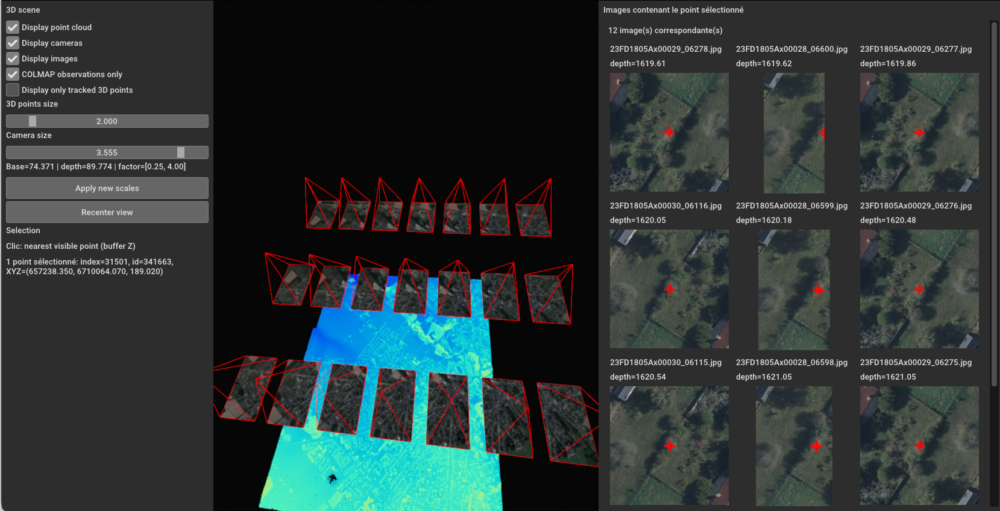
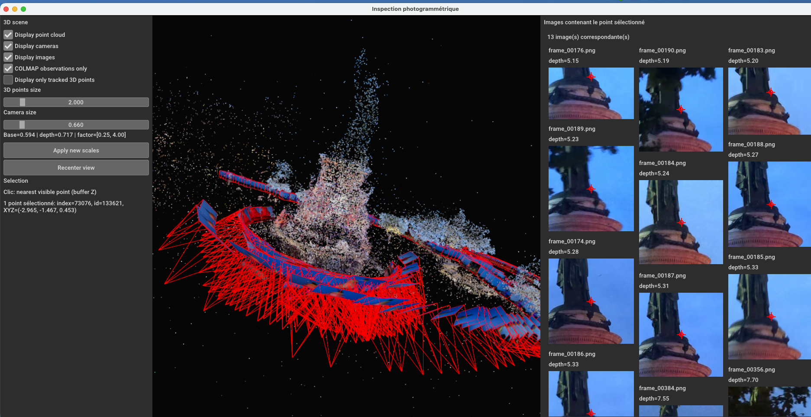

# aerial_data_to_gaussian_splats

`aerial_data_to_gaussian_splats` est un pipeline permettant de générer un fichier 3D `.ply` de **splats gaussiens** à partir d’un jeu de données géoréférencé, composé :

- d’**images orientées au format IGNF CON/XML**
- d’un **nuage de points LiDAR au format `.laz`**

Ces données sont d’abord converties vers un format exploitable par **COLMAP** puis un pipeline basé sur la librairie [Nerfstudio](https://docs.nerf.studio/) entraîne un modèle Gaussian Splat avant d’exporter un `.ply` final nettoyé.

Le résultat produit n’est pas un simple nuage de points : c’est un **`.ply` enrichi** contenant les paramètres des gaussiennes appris par le modèle :

- position
- échelle
- rotation
- opacité
- attributs de couleur
- autres attributs nécessaires au rendu

Ce fichier peut ensuite être ouvert dans un viewer compatible Gaussian Splats, comme [SuperSplat](https://superspl.at/editor).

---

## Présentation générale

Le pipeline se décompose en deux grandes phases :

### 1. Préparation du dossier d’entrée COLMAP / Nerfstudio
À partir :
- des images orientées
- des fichiers `.CON`
- du nuage LiDAR `.laz`

on génère un dossier `ori/` contenant notamment :

- `transforms.json`
- `colmap/sparse/0/...`
- les images de travail

Cette étape est une **conversion de données géoréférencées** vers un format compatible avec le pipeline.
Elle ne nécessite pas d’entraînement GPU.

### 2. Entraînement et export du Gaussian Splat
À partir du dossier `ori/` :

- estimation des plans `near` / `far`
- entraînement `splatfacto`
- export du `.ply`
- nettoyage final du `.ply`

Le livrable final recherché est :

```text
<root>/exports/<basename>.ply
```

---

## Prérequis

Le pipeline est conçu pour tourner sur un environnement **Linux** avec :

- `bash`
- **conda / mamba**
- **GPU NVIDIA + CUDA** pour la phase d’entraînement

L’environnement prêt à l’emploi utilisé pour ce projet est fourni ici :

```text
environment/ign.slurm/conda_env.yml
```

Exemple :

```bash
mamba env create -f environment/ign.slurm/conda_env.yml
mamba activate gsplat
```

Le projet a été pensé et testé principalement pour un contexte **serveur / Slurm**.

> Les étapes de conversion / préparation COLMAP ne nécessitent pas de GPU.
> Le GPU est principalement utile pour l’entraînement `splatfacto`.

---

## Produire le dossier COLMAP d’entrée

Le pipeline d’entraînement attend en entrée un dossier déjà préparé pour Nerfstudio / COLMAP, contenant :

- les images
- `transforms.json`
- `colmap/sparse/0/...` contenant notamment les points 3D, poses et paramètres caméra
- `sparse_pc.ply`, qui est une conversion du sparse 3D dans un format `.ply` exploitable par Nerfstudio

Dans le cas des données aériennes, ce dossier est généré à partir :

- d’un dossier d’images orientées au format **IGNF CON/XML**
- d’un fichier **LAZ** contenant les points LiDAR

Commande générique :

```bash
python python/con_laz_to_colmap.py \
  --laz <path/to/point_cloud.laz> \
  --images <path/to/oriented_images> \
  --out <path/to/output_ori_dir> \
  --num-terrain-points 4000000 \
  --image-factor 4
```

### Rôle de cette étape

Cette conversion transforme un jeu de données aérien métier en un dossier `ori/` directement exploitable par le pipeline.

À partir :

- des **images**
- de leurs **orientations externes et intrinsèques** stockées dans les fichiers `.CON`
- d’un **nuage LiDAR `.laz`**

le script :

1. décompresse et sous-échantillonne les images
2. lit les paramètres de caméra dans les fichiers `.CON`
3. lit le nuage LiDAR `.laz`
4. sous-échantillonne les points LiDAR en fonction du nombre final de points terrain souhaité
5. reprojette ces points LiDAR dans les images
6. génère une structure sparse COLMAP :
   - `cameras`
   - `images`
   - `points3D`
7. produit un `transforms.json` compatible Nerfstudio
8. exporte un `sparse_pc.ply` à partir des points 3D sparse

Cette étape ne fait pas une reconstruction photogrammétrique classique par matching d’images : elle **convertit une orientation déjà connue et un nuage LiDAR existant** en un format compatible avec **COLMAP** et **Nerfstudio**.

---

## Inspecter le résultat photogrammétrique

Une fois le dossier COLMAP généré, il est possible de l’inspecter avant entraînement avec :

```bash
python python/photogrammetry_inspector.py --colmap-dir <path/to/output_ori_dir>
```

Cette inspection permet de vérifier :

- la présence et l’organisation des images
- la cohérence des poses caméra
- la structure du dossier COLMAP
- la qualité globale du jeu photogrammétrique

C’est utile pour détecter tôt des problèmes de géométrie, de couverture ou de repère.

---

## Entrées du pipeline d’entraînement

Le script principal `run.sh` attend deux entrées obligatoires :

- `--colmap-dir <dir>` : dossier COLMAP existant
- `--image-dir <dir>` : dossier d’images associé

Le dossier COLMAP doit notamment contenir :

```text
<colmap-dir>/transforms.json
<colmap-dir>/colmap/sparse/0/
```

Le dossier d’images doit contenir au moins deux images compatibles :

- `.jpg`
- `.jpeg`
- `.png`

---

## Étapes du pipeline d’entraînement

### 1. Validation des entrées

Le pipeline vérifie :

- la présence du dossier COLMAP
- la présence du dossier d’images
- l’existence de `transforms.json`
- l’existence du modèle sparse dans `colmap/sparse/0`
- la présence d’au moins deux images exploitables

### 2. Chargement du profil d’entraînement

Le pipeline peut charger un profil d’entraînement via :

- `--gsplat-profile <name>`

Les profils sont définis dans :

```text
config/profiles/
```

Un profil regroupe les principaux **paramètres d’entraînement et d’export** du pipeline :

- la résolution d’entraînement
- le nombre d’itérations
- les paramètres de densification et de nettoyage
- les options de stabilité numérique
- les paramètres d’export du `.ply`

Cela permet de centraliser les réglages dans des fichiers réutilisables, afin de :

- lancer facilement plusieurs variantes d’entraînement
- adapter le pipeline à différents jeux de données
- conserver des presets reproductibles

Exemples de profils disponibles :
- `balanced`
- `quality`
- `PCRS`
- `PCRS2`
- `PCRS3`

### 3. Estimation des plans near / far

Avant l’entraînement, le pipeline estime automatiquement des plans proches / lointains à partir du sparse COLMAP :

- `python/estimate_planes.py`

Les valeurs sont injectées dans l’entraînement via le collider.

### 4. Entraînement du modèle

Le pipeline entraîne un modèle `splatfacto` de **Nerfstudio** à partir du dossier COLMAP fourni :

- `scripts/train.sh`

Sorties :
- configuration de run
- checkpoints
- logs d’entraînement

### 5. Export en `.ply`

Après entraînement, le pipeline exporte le résultat vers un fichier `.ply` via :

- `scripts/export_splat_to_ply.sh`

### 6. Nettoyage final du `.ply`

Le `.ply` exporté est post-traité à partir de la reconstruction sparse COLMAP via :

- `python/clean-ply.py`

Entrées :
- le `.ply` exporté
- `points3D.bin`
- `dataparser_transforms.json`

Le script :

1. charge les points 3D COLMAP
2. applique le même transform que Nerfstudio
3. filtre les points aberrants
4. estime une distance de voisinage
5. conserve les gaussiennes proches de la géométrie reconstruite

Sortie finale :

```text
<root>/exports/<basename>.ply
```

---

## Paramètres principaux

### Entrées

- `--colmap-dir <dir>`
- `--image-dir <dir>`
- `--root <dir>`
- `--name <name>`

### Profil

- `--gsplat-profile <name>`

### Options pipeline

- `--skip-conda`
- `--no-proxy`
- `--skip-training`
- `--skip-export`
- `--max-jobs <int>`

---

## Exécution sur Slurm

Le lancement sur Slurm se fait via :

```bash
GIT_ROOT=/path/to/aerial_data_to_gaussian_splats \
bash /path/to/aerial_data_to_gaussian_splats/environment/ign.slurm/launch.sh
```

Le script `launch.sh` s’appuie sur un fichier de configuration `config.sh` placé dans le dossier de lancement du script. Ce fichier permet de définir les variables utilisées pour le lancement du pipeline:

```text
ROOTDIR=/path/to/output_root
GSPLAT_PROFILE=<profile_name>
BASENAME=<run_name>

COLMAP_DIR=/path/to/input_ori_dir
IMAGE_DIR=/path/to/input_ori_dir/images

#SKIP_TRAINING=true
```

Variables principales :

ROOTDIR : dossier racine de sortie
GSPLAT_PROFILE : profil d’entraînement utilisé
BASENAME : nom de base du fichier .ply final
COLMAP_DIR : dossier ori/ préparé en amont
IMAGE_DIR : dossier d’images associé
SKIP_TRAINING=true : permet de relancer uniquement l’export / nettoyage si besoin


### Remarque importante

Les étapes de préparation du dossier COLMAP (conversion, inspection, etc.) **n’ont pas besoin de GPU**.
La ressource GPU est nécessaire pour :

- l’entraînement `splatfacto`
- l’export du modèle entraîné

---

## Reprise et exécution partielle

Le pipeline peut être relancé sans tout recalculer.

Il permet notamment de :

- sauter l’entraînement via `--skip-training`
- sauter l’export via `--skip-export`
- reprendre un entraînement à partir d’un checkpoint Nerfstudio si disponible

Cela facilite :

- les reprises après erreur
- le debug
- les exécutions partielles sur cluster

---

## Architecture du projet

Structure principale :

```text
aerial_data_to_gaussian_splats/
├── config/
│   ├── config.sh
│   └── profiles/
├── environment/
│   ├── ign.slurm/
│   └── macosx/
├── python/
│   ├── clean_gaussian_ply.py
│   ├── clean-ply.py
│   ├── colmap_convert_to_txt.py
│   ├── compare_colmap_references.py
│   ├── con_laz_to_colmap.py
│   ├── decompress-jp2.py
│   ├── estimate_planes.py
│   ├── make_preview.py
│   ├── photogrammetry_inspector.py
│   ├── ply_convert.py
│   └── run_colmap.py
├── scripts/
│   ├── export_splat_to_ply.sh
│   ├── generate_colmap.sh
│   └── train.sh
├── run.sh
└── README.txt
```

### Rôle des principaux dossiers

- `config/` : configuration globale et profils d’entraînement
- `python/` : scripts Python de conversion, inspection, estimation et nettoyage
- `scripts/` : scripts shell d’entraînement, génération COLMAP et export
- `environment/` : environnements d’exécution, notamment Slurm
- `run.sh` : point d’entrée principal du pipeline

---

## Exemples

### 1. Générer le dossier COLMAP d’entrée

```bash
python python/con_laz_to_colmap.py \
  --laz <path/to/point_cloud.laz> \
  --images <path/to/oriented_images> \
  --out <path/to/output_ori_dir> \
  --num-terrain-points 4000000 \
  --image-factor 4
```

### 2. Inspecter le résultat photogrammétrique

```bash
python python/photogrammetry_inspector.py --colmap-dir <path/to/output_ori_dir>
```


Exemple de visualisation produite lors de l’inspection du dossier photogrammétrique :

<table>
  <tr>
    <td align="center">
      <br />
      <sub>PVA PCRS avec nuage de points LiDAR</sub>
    </td>
    <td align="center">
      <br />
      <sub>Photogrammétrie issue d'une vidéo autour de la statue de la République</sub>
    </td>
  </tr>
</table>


### 3. Entraînement complet

```bash
./run.sh \
  --colmap-dir <path/to/output_ori_dir> \
  --image-dir <path/to/output_ori_dir/images> \
  --root <path/to/output_root> \
  --gsplat-profile PCRS3
```

### 4. Reprendre sans refaire l’entraînement

```bash
./run.sh \
  --colmap-dir <path/to/output_ori_dir> \
  --image-dir <path/to/output_ori_dir/images> \
  --root <path/to/output_root> \
  --gsplat-profile PCRS3 \
  --skip-training
```
